# multi-swe-day

A skill that has one leader chat, several builder chats and
an auditor chat split software work between them over
gitchat. It ships four small programs: a lane registry, a
listener for terminal reports, a next-action banner, and a
builder for a diff review folder.

The lane registry refuses overlapping lanes.

<picture>
  <source
    media="(prefers-reduced-motion: reduce)"
    srcset="assets/poster.svg"
  />
  
</picture>

The demo is reconstructed from
[`evidence/transcripts/registry-session.txt`](evidence/transcripts/registry-session.txt),
a captured run of two of the programs in a throwaway
directory. The images show each command line, the refusal
line, the first line of the banner and the exit statuses.
They leave out the JSON the registry prints, the banner's
indented `next:` line, and the `$ echo "exit status: $?"`
lines; the transcript has all of them. Each command ran in
its own `bash -c` with the `reg` function definition put in
front of it, and the recorder wrote the `$` lines and the
exit status lines itself.

A lane is a repository-relative path. `register` compares a
new lane with the lanes of every other builder in the
registry file and refuses an exact match, an ancestor or a
descendant, with exit status 4. Among the things `register`
does not refuse: a builder whose status is `aborted` does
not block, and registering a slug again replaces that
slug's own row. A `landed` builder's lanes still block.
[`SECURITY.md`](SECURITY.md) has the fuller list of what the
registry does and does not check.

**Not measured, stated up front.**

- No agent ran a multi-swe-day network to produce the
  evidence here. The registry transcript shows only the
  registry and the banner, run from a shell; both agent
  transcripts (under "Agent invocations" below) stop at the
  preflight.
- Whether agents that follow `SKILL.md` keep to their lanes,
  stop at each human gate, or leave pushing to the operator
  has not been measured. The registry records lanes; no
  program checks which files a builder edits. The registry
  refuses `confirm` without a `--propose` value (anything
  but empty or whitespace; it does not look the PROPOSE up)
  and refuses
  to mark a lane `landed` until the `human-review` gate has
  been recorded and cleared, but it cannot tell whether the
  operator or an agent ran `run-clear-gate`, and no program
  stops a push.
- The recorded session passes no `--lock-path`, so the
  registry's lock check does not run in it.
- No test or recording here runs the programs against a
  gitchat or a swe-day release. The tests write their own
  message fixtures and their own lock metadata file.
- Neither install block below was run under a client. The
  agent runs loaded the skill through `--plugin-dir` (Claude
  Code) and through a copy committed in the fixture (Codex).

## It needs gitchat and swe-day

multi-swe-day is composition. A run across several chats
needs both; a single session (the "Single session" note in
`SKILL.md`) needs only the swe-day lock.

- **gitchat is required across chats.** Every message
  between chats is a gitchat envelope, and `msd_listen.py`
  reads gitchat's outbox branches. The skill text names gitchat's
  `gitchat_send.py` and `gitchat_poll.py`. gitchat is the
  sibling repository `trycopilotai/gitchat`. Read its own
  security notes before you give anyone push access to the
  remote it uses: `msd_listen.py` prints any `response` or
  `error` message on that remote that is addressed to the
  leader's slug.
- **swe-day supplies the lock.** The leader holds the lock
  that `swe_day_lock.py` manages. It is in the sibling
  repository `trycopilotai/swe-day`, with the swe-day skill
  the text has builders re-read.

Neither is vendored here, and no version of either is
pinned.

## What is in it

- [`skills/multi-swe-day/SKILL.md`](skills/multi-swe-day/SKILL.md)
  is the role contract: the leader, the builders, the
  auditor, the four programs, and the invariants the text
  asks each role to keep.
- [`skills/multi-swe-day/references/PROTOCOL.md`](skills/multi-swe-day/references/PROTOCOL.md)
  is the numbered procedure: bring-up, dispatch, the
  verify-before-implement gate, fan-out, reconcile, the
  auditor loop, crash recovery and the run phase model.
- [`skills/multi-swe-day/references/`](skills/multi-swe-day/references/)
  also holds three prompts to paste into a chat:
  `leader.prompt.md`, `builder.prompt.md` and
  `auditor.prompt.md`. The leader and builder prompts are
  upgrade prompts: they were written to move a network that
  is already running, with a lock held and work in flight,
  onto this skill, and they read that way.
- [`skills/multi-swe-day/scripts/msd_lane_registry.py`](skills/multi-swe-day/scripts/msd_lane_registry.py)
  keeps the registry file: `init` (also accepted as
  `adopt`, an alias of `init`), `register`, `confirm`,
  `update`, `release`, `status`, `run-advance` and
  `run-clear-gate`.
- [`skills/multi-swe-day/scripts/msd_listen.py`](skills/multi-swe-day/scripts/msd_listen.py)
  prints `response` and `error` envelopes addressed to one
  slug and records the ids it printed.
- [`skills/multi-swe-day/scripts/msd_next.py`](skills/multi-swe-day/scripts/msd_next.py)
  renders the next-action banner from the registry file.
- [`skills/multi-swe-day/scripts/msd_review_open.py`](skills/multi-swe-day/scripts/msd_review_open.py)
  writes one `.diff` file per path that
  `git diff --name-only` lists, except paths matched by
  `--skip-glob`, and a checklist. Two paths whose names
  differ only by `/` and `-` share one `.diff`, and the
  later one overwrites the earlier. It then opens both in
  VS Code on macOS. Pass `--no-open` on any other system:
  opening uses the macOS `open` and `osascript` commands.
- Three test files sit beside the programs:
  `test_msd_lane_registry.py`, `test_msd_next.py` and
  `msd_listen_test.py`.

[`SECURITY.md`](SECURITY.md) lists what the programs check
and what only the text asks of an agent.

## Not included

- **gitchat and swe-day**, as above.
- **A wrapper.** The skill expects each consuming repository
  to bind the registry path, the role-to-slug map, the lock
  path, the gitchat scripts and remote, and the review
  method. No wrapper ships here.
- **l8.** The auditor role applies a review method the text
  calls l8, with an L9/L10 addendum. That method is not in
  this repository; a wrapper binds one.
- **The review extension.** `msd_review_open.py` writes two
  placeholder files for a companion VS Code review
  extension, and the text
  mentions an `address-comments` skill that reads the
  comments it leaves. Neither ships here. Without them the
  program still writes the diff files and the checklist.

`swe-day-leader` and `swe-day-follower-0N` are the example
slugs the text was written against, and `drizzle/meta` is
its example of a generated directory to skip. Use your own.
The text calls the repository only the leader writes the
operational repo, the private operational repo, the private
repo, or `ops-repo`; these all mean the same thing, and
"private state" means what is kept there.

## Known limits

Under Claude Code, with swe-day not installed, the agent
searched outside the operational repository (all of
`~/.claude`, the top two levels of `/`, and the directory
holding the plugin and the fixture) before it stopped at the
preflight, although the skill says not to. In an earlier run
where a swe-day checkout was reachable on disk, it used that
checkout, set up the lock and two lanes, built both items,
and parked at human review without merging or pushing.
Codex stopped at the preflight without searching outside
the fixture.

## Use it

Read
[`skills/multi-swe-day/SKILL.md`](skills/multi-swe-day/SKILL.md)
and
[`skills/multi-swe-day/references/PROTOCOL.md`](skills/multi-swe-day/references/PROTOCOL.md)
before you install it. They are instruction sets that steer
agents, so both installs below are pinned to a tag rather
than to `main`.

### Claude Code

Save this as `install.sh` and run it with `sh install.sh`.
It sets `set -eu` and an `EXIT` trap, so pasting it straight
into an interactive shell will end that shell if the clone
fails.

```sh
set -eu
release=v0.1.8
install_target="$HOME/.claude/skills/multi-swe-day"
install_parent="$(dirname "$install_target")"
mkdir -p "$install_parent"
install_tmp="$(mktemp -d "$install_parent/.multi-swe-day.XXXXXX")"
install_stage="$install_tmp/package"
rollback_install() {
  if [ ! -e "$install_target" ]; then
    if [ -e "$install_tmp/previous" ]; then
      mv "$install_tmp/previous" "$install_target"
    fi
  fi
  rm -rf "$install_tmp"
}
trap rollback_install EXIT
git clone --quiet --depth 1 --branch "$release" \
  https://github.com/trycopilotai/multi-swe-day \
  "$install_tmp/clone"
mkdir -p "$install_stage"
cp -R "$install_tmp/clone/skill/." "$install_stage/"
if [ -e "$install_target" ]; then
  mv "$install_target" "$install_tmp/previous"
fi
mv "$install_stage" "$install_target"
trap - EXIT
rm -rf "$install_tmp"
```

Invoke it as `/multi-swe-day`.

### Codex

Save this one the same way. The only line that differs from
the block above is `install_target`.

```sh
set -eu
release=v0.1.8
install_target="$HOME/.agents/skills/multi-swe-day"
install_parent="$(dirname "$install_target")"
mkdir -p "$install_parent"
install_tmp="$(mktemp -d "$install_parent/.multi-swe-day.XXXXXX")"
install_stage="$install_tmp/package"
rollback_install() {
  if [ ! -e "$install_target" ]; then
    if [ -e "$install_tmp/previous" ]; then
      mv "$install_tmp/previous" "$install_target"
    fi
  fi
  rm -rf "$install_tmp"
}
trap rollback_install EXIT
git clone --quiet --depth 1 --branch "$release" \
  https://github.com/trycopilotai/multi-swe-day \
  "$install_tmp/clone"
mkdir -p "$install_stage"
cp -R "$install_tmp/clone/skill/." "$install_stage/"
if [ -e "$install_target" ]; then
  mv "$install_target" "$install_tmp/previous"
fi
mv "$install_stage" "$install_target"
trap - EXIT
rm -rf "$install_tmp"
```

Invoke it as `$multi-swe-day`.

Each block works in a temporary `.multi-swe-day.*` directory
beside the target and removes it on exit. An existing
install at the target is replaced.

Both blocks were run twice against a local copy of this
tag with git 2.50.1. Each run printed, even with `--quiet`,
git's warning that the tag "is not a commit" and its note
about a detached `HEAD`. Both are expected for a clone
pinned to an annotated tag; another git version may print
something else.

Both blocks copy through `skill/`, a symlink to
`skills/multi-swe-day/`, so the installed directory holds
`SKILL.md`, `agents/`, `references/` and `scripts/` as real
files. The repository also carries
`.claude-plugin/plugin.json` and `.codex-plugin/plugin.json`
for a marketplace. No marketplace lists this skill, so no
marketplace install is described here.

## Evidence

`evidence/transcripts/registry-session.txt` is the captured
run behind the claim at the top of this file.
`scripts/record_session.py` ran each command in its own
`bash -c`, with the `reg` function definition in front of
it, and wrote each `$` line and each exit status line
itself; the rest is the two programs' output as captured,
with no edit. The recorder writes nothing if the
capture contains the throwaway directory's path or the
recording machine's hostname. `evidence/demo-manifest.json`
records the SHA-256 of both programs and of `SKILL.md`, the
commands, the interpreter, the date, and the SHA-256 of the
transcript.

While this release was prepared, `make check` was run on
one macOS machine with Python 3.9.6, 3.11.15 and 3.13.13;
no other version or system was tried. The manifest records
only the interpreter that made the recording.

`make check` runs the programs' own tests and a packaging
contract that ties this file, both plugin manifests, the
transcript and the demo images to each other.

### Agent invocations

Each client was given the same prompt (only `/multi-swe-day`
or `$multi-swe-day` differs) on one synthetic fixture: a
small Python repository with two work items in `TODO.md`
and a separate operational repository at `./ops`. Only
multi-swe-day was installed. This is one run per client,
not a benchmark.

- [`evidence/transcripts/2026-10-05-claude-code-invocation.txt`](evidence/transcripts/2026-10-05-claude-code-invocation.txt):
  Claude Code 2.1.220 loaded the skill with the `Skill`
  tool, searched outside the operational repository for
  swe-day, then stopped at the preflight and asked where
  swe-day is installed. It changed nothing.
- [`evidence/transcripts/2026-10-05-codex-invocation.txt`](evidence/transcripts/2026-10-05-codex-invocation.txt):
  Codex 0.146.0 read the skill and stopped at the preflight,
  naming the missing swe-day skill and `swe_day_lock.py`,
  without searching outside the fixture. It changed nothing.

`scripts/render_invocation.py` rendered both from the
clients' raw output, which is not committed. The transcripts
show the prompt, every tool call with its arguments cut at
300 characters, each call's status where the output gives
one, and the final message; tool output is left out. The
only edits are path replacements, listed per run in the
`invocations` list of `evidence/demo-manifest.json`, which
also records each transcript's and raw output's SHA-256. A
root matches only when the character after it is `/`,
whitespace, a quote, a backslash, `)` or end of text, and the
character before it is whitespace, a quote, `=`, `(` or start
of text.
An earlier Claude Code run that reached paths outside its
fixture is recorded there with `"published": false`.

## Contributing

See [`CONTRIBUTING.md`](CONTRIBUTING.md).

## Security

See [`SECURITY.md`](SECURITY.md).

## License

MIT. See [`LICENSE`](LICENSE).

## Not affiliated with GitHub or GitHub Copilot

The `trycopilotai` organisation name is not a claim of any
relationship with GitHub Copilot. This project is not
affiliated with, endorsed by, or sponsored by GitHub, Inc.
GitHub and GitHub Copilot are trademarks of GitHub, Inc.
